<h1 align="center"> Rent Car With Driver App</h1>   

 &nbsp;

<!-- START doctoc generated TOC please keep comment here to allow auto update -->
<!-- DON'T EDIT THIS SECTION, INSTEAD RE-RUN doctoc TO UPDATE -->

## Table of Contents

- [Table of Contents](#table-of-contents)
- [Introduction](#introduction)
- [Branch Navigation](#branch-navigation)
- [Screenshots](#screenshots)
- [System Requirements](#system-requirements)
- [Technologies](#technologies)
- [Contributors](#contributors)

<!-- END doctoc generated TOC please keep comment here to allow auto update -->

 

## Introduction

This mobile application connects passengers and drivers, allowing them to easily find each other and rent a car together. Passengers can view a driver's car details such as model, make, color, and year, as well as the driver's age, gender, abilities, location, and more. Passengers can filter their search based on these categories to find the perfect driver for their needs. In addition, both drivers and passengers can chat with each other within the app to coordinate their plans.

After the ride, passengers can leave a review for the driver to provide feedback and help other users make informed decisions. This mobile application makes it easy and convenient for passengers and drivers to connect, plan, and review their trips. 

 

## Branch Navigation

Mobile : [mobile-main](https://github.com/toastwareDevelopers/Rent-Car-With-The-Driver-App/tree/mobile-main) branch  
Backend : [backend-main](https://github.com/toastwareDevelopers/Rent-Car-With-The-Driver-App/tree/backend-main) branch  
Web : [web-main](https://github.com/toastwareDevelopers/Rent-Car-With-The-Driver-App/tree/web-main) branch  

 

## Screenshots

* Login Page and Forgot Password Page   
    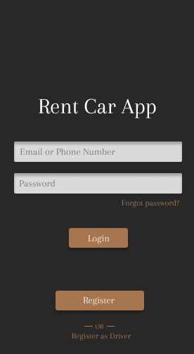 &nbsp;
    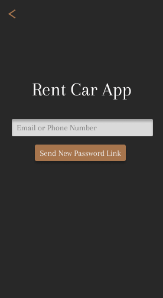

* Register Driver Pages   
    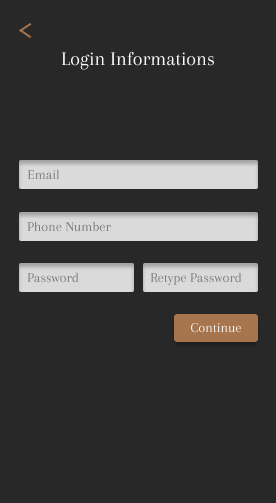 &nbsp;
    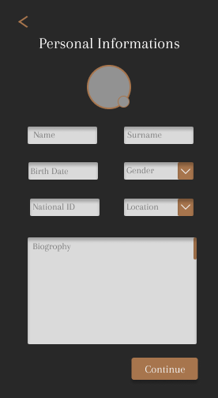 &nbsp;
    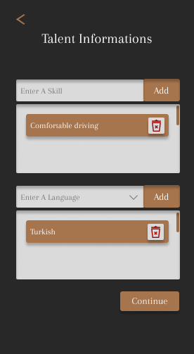 &nbsp;
    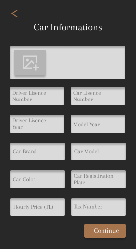 &nbsp;
    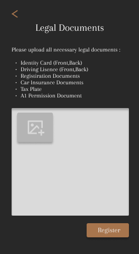 &nbsp;
    
* Register Customer Page   
    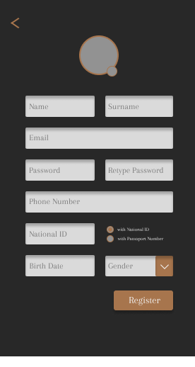

* Profile Driver Pages   
    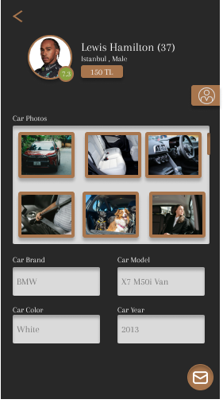 &nbsp;
     &nbsp;

* Profile Customer Pages   
    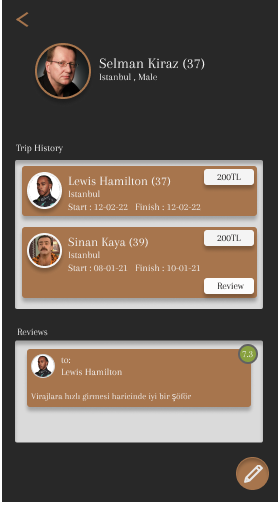 &nbsp;
    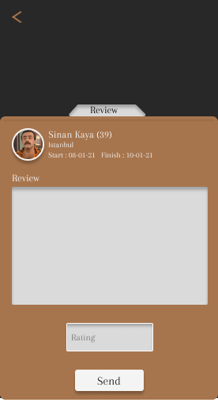

* Home Customer Page   
    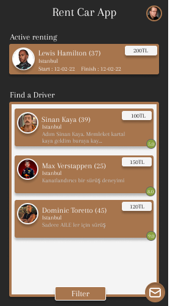 &nbsp;
    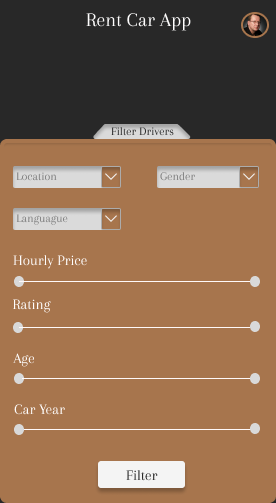 &nbsp;

* Home Driver Page   
    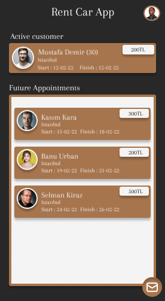 &nbsp;

* Chat and Offer Pages   
     &nbsp;
    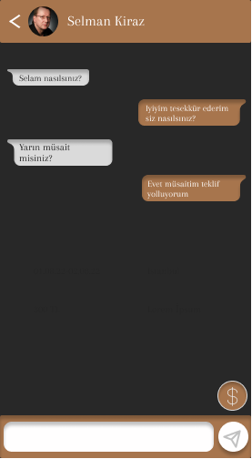 &nbsp;
    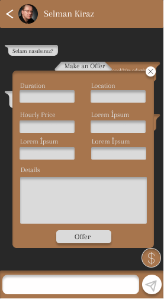 &nbsp;
    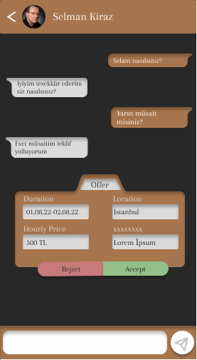 &nbsp;
    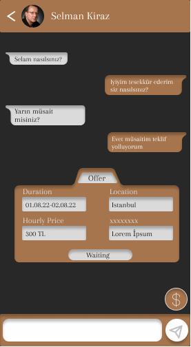 &nbsp;
    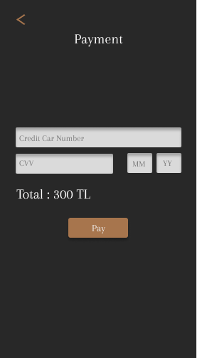 &nbsp;

* Admin Pages   
    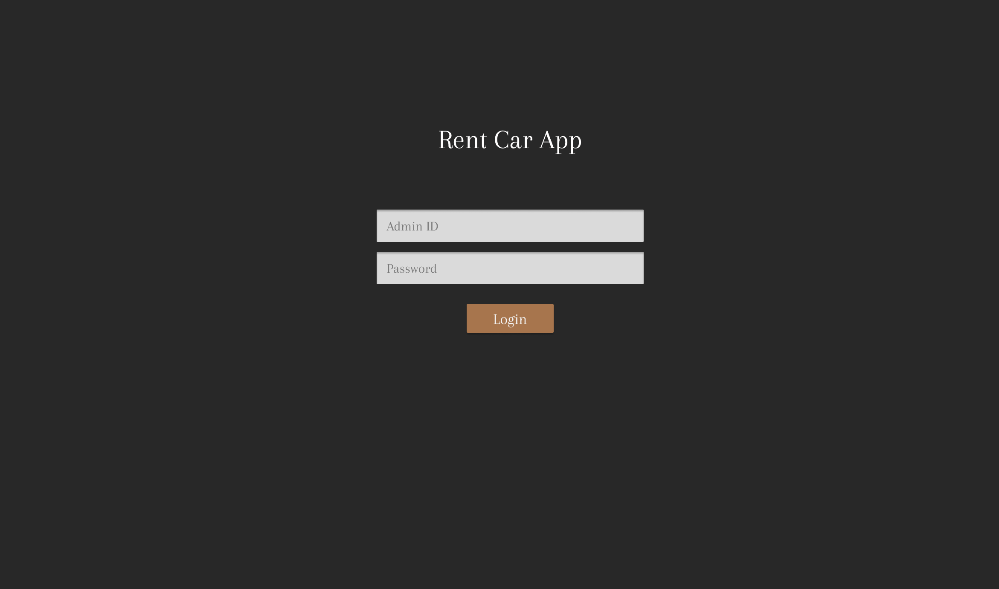 &nbsp;
    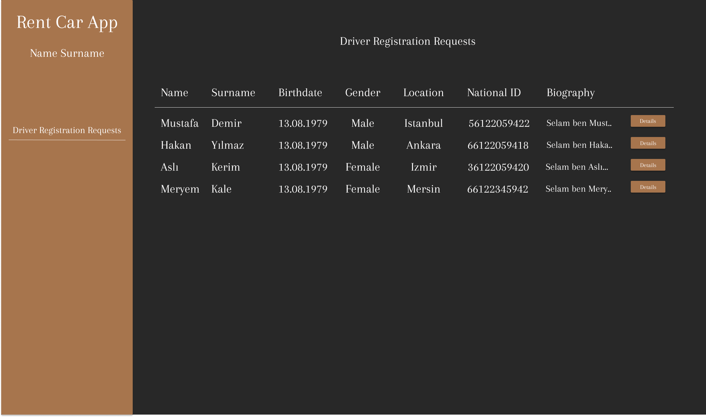 &nbsp;
    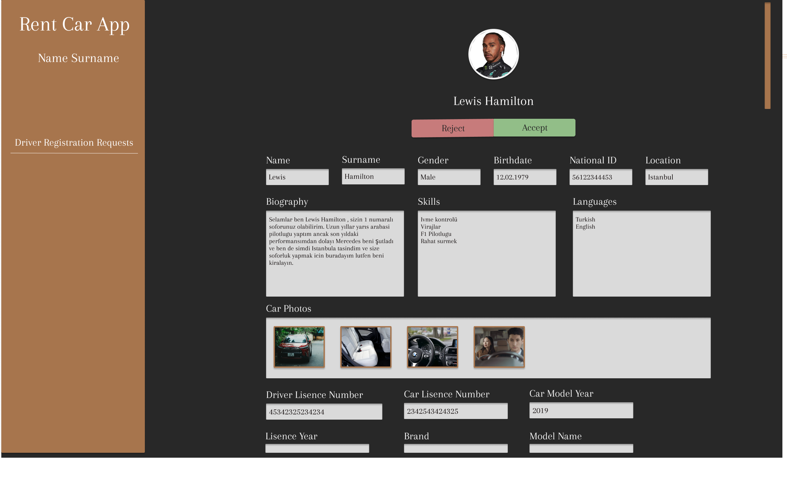 &nbsp;

## System Requirements

- Flutter 3.7 (or higher)
- Node.Js 15.14.0 (or higher)

## Technologies

- Flutter
- Node.Js
- PHP
- SocketIO
- Javascript
- HMTL / CSS
- MongoDB
 
## Contributors

Harun Eren Özkaya : [harunerenozkaya](https://pages.github.com/)  
Süleyman Burak Yaşar : [4o4x](https://pages.github.com/)  
Eray Yaşar : [eraysr378](https://pages.github.com/)  
Taha Kınalı : [Tk749](https://pages.github.com/)  
Yusuf Alperen Dönmez : [DaPhantomxx](https://pages.github.com/)  
Berkan Akın : [brkn45](https://pages.github.com/)  
